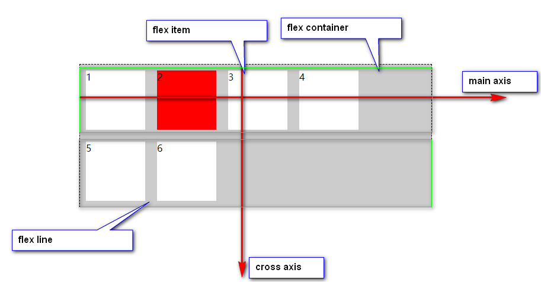

# Flex layout

## 解释 display :  flex | inline-flex;

### css formatting context

当我们使用 display: flex | inline-flex;  实际上我们就生成了 一个 css 格式化上下文； css 常见有以下四种 格式化 上下文

1. BFC block formatting context  -- display: block;

2. IFC inline formatting context -- display: inline;

3. GFC grid formatting context -- display: grid;

4. FFC flex formatting context  -- display: flex;

### display: block 与 display: flex 异同 （BFC versus FFC）
> 两者对给定的一种 格式化 环境，而 处于 环境内的 元素 的布局 会受到环境的影响；

1. BFC: 
  * 内部的盒子会垂直放置，宽度会撑满父盒子；
  * 相邻之间的盒子之间的margin 会合并；
  * 浮动的盒子不会与其它盒子重叠；
  * 清除浮动之后，浮动盒子的高度，会被计算在内；

2. FFC
  * 内部盒子 会从左到右 水平排列， 盒子沿 cross axis 方向 会撑满父盒子；
  * 相邻盒子之间的 margin 不会合并；
  * float 属性 不再起作用，类似 vertical-align, clear 都是专门针对 BFC 而设计的；

### Flex Layout Box Model
格式化上下文是一个很抽象的概念，我们希望能利用一个盒子，将其具象化，这个盒子就是 flex layout box model;

1. flex formatting context 中的对象

  * flex container | flex item
  * main axis | cross axis
  * flex line (默认都是 single line, 使用flex: wrap 属性之后，有可能生成 multiple line))

2. flex container 中可以使用的属性 
  * flex-direction  
  * flex-wrap
  * flex-flow
  * justify-content
  * align-item
  * align-content

3. flex item 中可以使用的属性
  * flex-grow
  * flex-shrink
  * flex-basis
  * order
  * align-self

### 盒子中的对象，

### display: flex 与 display: inline-flex 的区别

## the difference between flex and inline-flex

> https://stackoverflow.com/questions/27418104/difference-between-displayinline-flex-and-displayflex

## difference between align-items and align-content

> https://stackoverflow.com/questions/24313271/display-property-differences-for-inline-something

## justify-content and align-items

> the first just for main axis , another is just for cross axis; 

